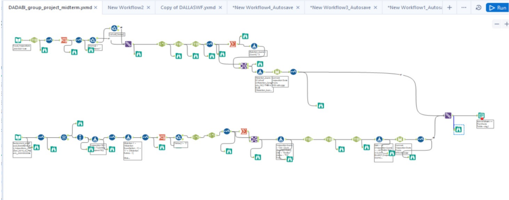
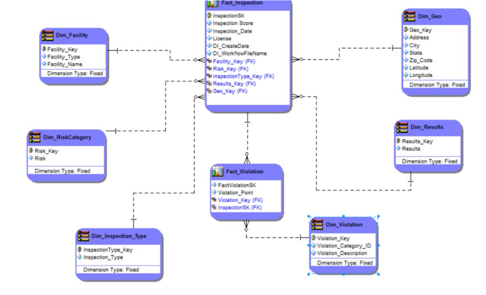
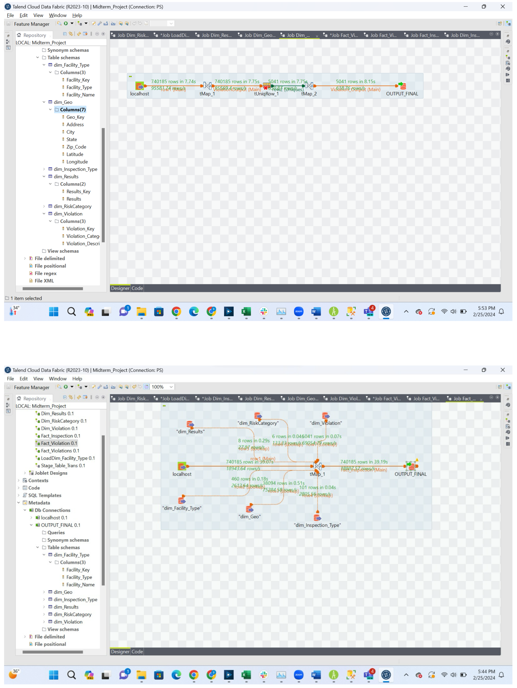
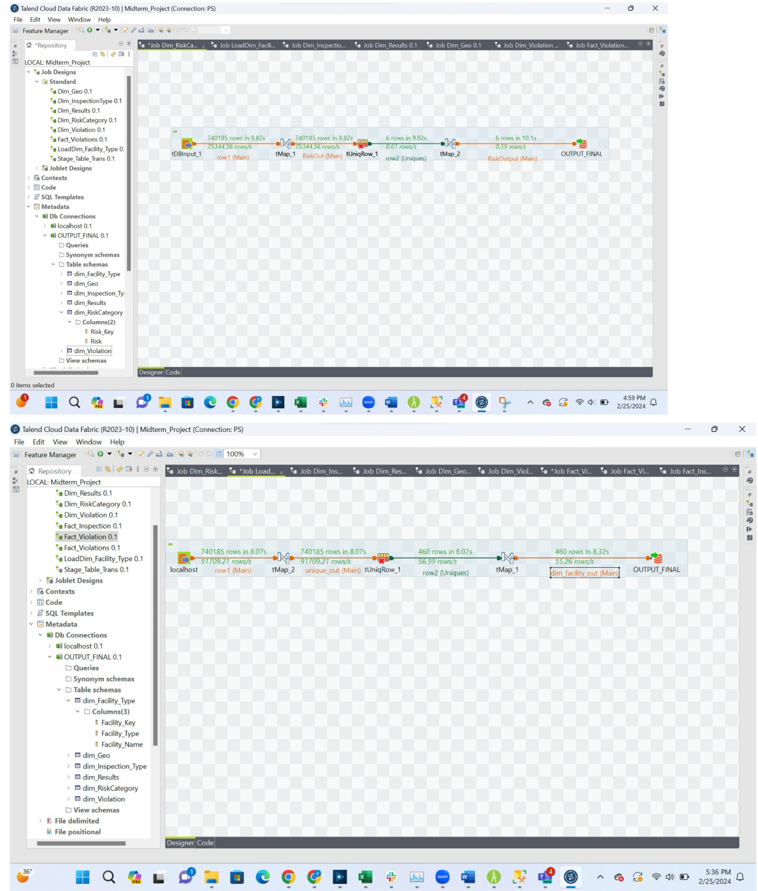
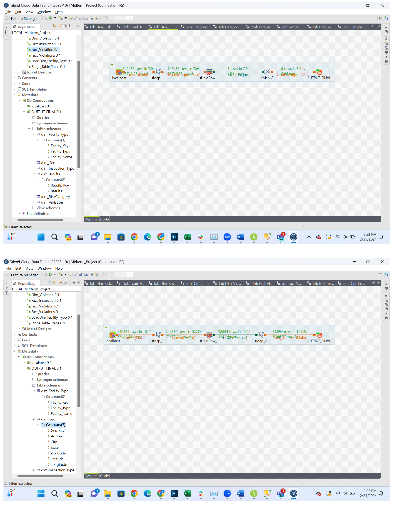
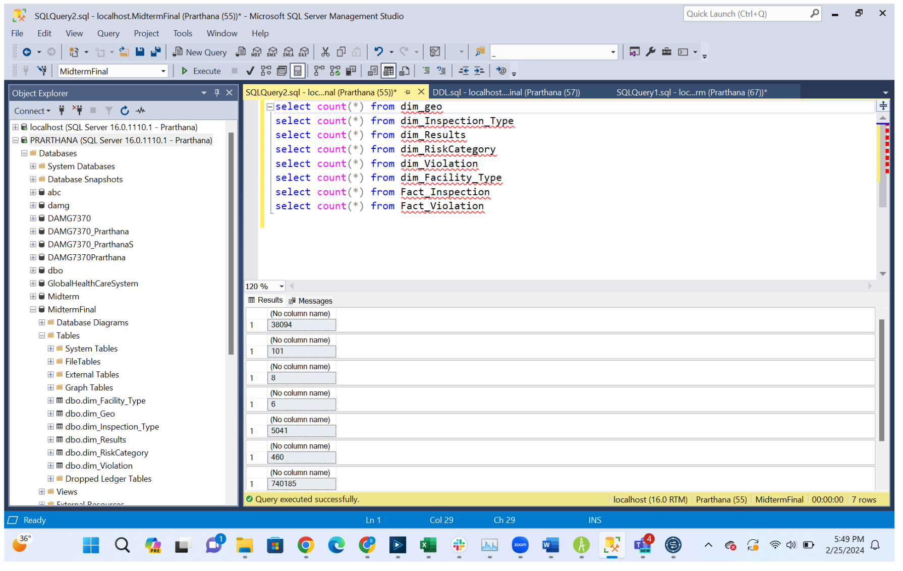

# 🍽️ Food Inspection BI Pipeline — Dallas & Chicago

> End-to-end Business Intelligence pipeline integrating 740K+ food inspection records across two cities into a unified dimensional model for compliance analytics.

**Stack:** Alteryx · Talend · SQL Server · ER/Studio · T-SQL

---

## Table of Contents

1. [Project Summary](#project-summary)
2. [Architecture Overview](#architecture-overview)
3. [Repository Structure](#repository-structure)
4. [Data Sources](#data-sources)
5. [Pipeline Walkthrough](#pipeline-walkthrough)
   - [Stage 1 — Data Profiling (Alteryx)](#stage-1--data-profiling-alteryx)
   - [Stage 2 — Schema Alignment & Staging](#stage-2--schema-alignment--staging)
   - [Stage 3 — Dimensional Modeling (Star Schema)](#stage-3--dimensional-modeling-star-schema)
   - [Stage 4 — ETL Loading (Talend)](#stage-4--etl-loading-talend)
6. [Intermediate Transformation Artifacts](#intermediate-transformation-artifacts)
7. [Key Engineering Decisions](#key-engineering-decisions)
8. [Data Quality & Transformation Log](#data-quality--transformation-log)
9. [Schema Reference (from ER/Studio DM1)](#schema-reference-from-erstudio-dm1)
10. [Row Counts (Post-Load)](#row-counts-post-load)
11. [Dashboard Requirements](#dashboard-requirements)
12. [Setup & Reproduction](#setup--reproduction)
13. [Known Issues & Future Work](#known-issues--future-work)

---

## Project Summary

This project executes a full BI lifecycle on publicly available food inspection data from Chicago (IL) and Dallas (TX). The two datasets are structurally different — Chicago uses pipe-delimited violations in a single column, Dallas spreads violations across wide columns; Chicago tracks risk categorically, Dallas derives it from scores — requiring deliberate schema reconciliation before any useful analytics can run.

The output is a clean star schema loaded into SQL Server, ready to power dashboards that answer questions like:

- Which facility types fail inspections most frequently?
- How do violation point totals trend over time by city?
- Which zip codes have the highest concentration of high-risk establishments?
- What are the most commonly cited violation codes across both cities?

---

## Architecture Overview

```
┌─────────────────────────────────────────────────────────────────┐
│                        SOURCE LAYER                             │
│   Chicago Open Data (CSV)          Dallas Open Data (CSV)       │
└──────────────────┬──────────────────────────┬───────────────────┘
                   │                          │
                   ▼                          ▼
┌─────────────────────────────────────────────────────────────────┐
│                     PROFILING & TRANSFORM                       │
│          Alteryx — field profiling, type coercion,              │
│          violation unpivot, score normalization                 │
└──────────────────────────────┬──────────────────────────────────┘
                               │
                               ▼
┌─────────────────────────────────────────────────────────────────┐
│                       STAGING (SQL Server)                      │
│                    stg_2 — unified flat table                   │
│                       (740,185 rows)                            │
└──────────────────────────────┬──────────────────────────────────┘
                               │
                               ▼
┌─────────────────────────────────────────────────────────────────┐
│                    ETL LOADING (Talend)                         │
│      Deduplicate → resolve surrogate keys → load dims/facts     │
└──────────────────────────────┬──────────────────────────────────┘
                               │
                               ▼
┌─────────────────────────────────────────────────────────────────┐
│                  TARGET (MidtermFinal — SQL Server)             │
│                                                                 │
│   Dim_Facility      Dim_Geo         Dim_RiskCategory            │
│   Dim_Results       Dim_Inspection_Type   Dim_Violation         │
│                                                                 │
│              Fact_Inspection ◄── Fact_Violation                 │
└─────────────────────────────────────────────────────────────────┘
```

---

## Repository Structure

```
FoodEstablishmentInspection/
├── README.md
├── .gitignore
├── LICENSE
├── data/
│   └── intermediate/
│       ├── city_zip_raw.csv              # Chicago City+Zip before standardization (City all-null)
│       ├── city_zip_lookup_applied.csv   # City filled via zip lookup (semicolon-delimited)
│       ├── city_zip_final.csv            # Final standardized City+Zip — production-ready
│       └── dallas_city_zip_prestage.csv  # Dallas rows before 'Dallas'/'TX' imputation
├── docs/
│   ├── images/
│   │   ├── alteryx_profiling_workflow.png
│   │   ├── star_schema_diagram.png
│   │   ├── talend-workflow-1.png         # Dim_Violation + Fact_Inspection jobs
│   │   ├── talend-workflow-2.png         # Fact_Violation + Dim_Geo jobs
│   │   ├── talend-workflow-3.png         # Dim_RiskCategory + Dim_Facility jobs
│   │   └── ssms_row_counts.png
│   ├── resources/                        # Icon files referenced by generate_script_report.html
│   ├── generate_script_report.html
│   └── Midterm_Team_Project.pdf
├── models/
│   └── dim_model.DM1                     # ER/Studio star schema model
├── scripts/
│   └── ddl.sql                           # Staging + all dimension and fact table DDL
└── workflow/
    ├── alteryx_chicago_pipeline.yxmd
    └── alteryx_dallas_pipeline.yxmd
```

> `.metadata/` is excluded via `.gitignore` — Alteryx/Talend IDE workspace folder with machine-specific lock and log files.

---

## Data Sources

| Dataset | City | Volume | Coverage | Source |
|---|---|---|---|---|
| Chicago Food Inspections | Chicago, IL | ~267,908 rows | Jan 2010 – present | Chicago Data Portal |
| Dallas Food Inspections | Dallas, TX | ~350,088 rows | Oct 2016 – present | Dallas OpenData |

Both datasets are public and updated regularly. The Chicago dataset is maintained by the Chicago Dept. of Public Health; inspectors use a standardized procedure reviewed by a State-licensed Environmental Health Practitioner (LEHP).

> **Total records after violation unpivoting:** 740,185 rows in staging (`stg_2`). Each source record fans out into multiple rows when violations are normalized from wide/delimited format into one row per violation.

---

## Pipeline Walkthrough

### Stage 1 — Data Profiling (Alteryx)

Before writing a single transformation, each field was profiled for uniqueness %, null %, min/max character length, and data type. The workflow below shows the Chicago pipeline (top) and Dallas pipeline (bottom) running in parallel.



Selected profiling findings that drove downstream decisions:

| Field | Dataset | Finding | Action Taken |
|---|---|---|---|
| `Violation` | Chicago | 72% unique, 27.42% null, pipe-delimited multi-value | Unpivot via Text to Columns + transpose |
| `Street Direction` | Dallas | 66.98% null | Excluded from concatenated address |
| `Street Unit` | Dallas | 64.36% null | Excluded from concatenated address |
| `Facility_Type` | Dallas | Column absent | Imputed as `'Restaurant'` |
| `License` | Dallas | Column absent | Added with NULL values for schema alignment |
| `Risk` | Chicago | Categorical (Category 1/2/3) | Retained as-is |
| `Risk` | Dallas | Not collected | Derived from score distribution brackets |

---

### Stage 2 — Schema Alignment & Staging

Both datasets were merged into a single staging table (`stg_2`) in SQL Server. The unified schema:

```sql
CREATE TABLE [dbo].[stg_2] (
    [Inspection_SK]          INT IDENTITY(1,1) NOT NULL,
    [Inspection ID]          NVARCHAR(1000),
    [Facility Name]          NVARCHAR(1000),
    [License]                BIGINT,
    [Facility Type]          NVARCHAR(1000),
    [Inspection Type]        NVARCHAR(1000),
    [Inspection_Date]        DATE,
    [Inspection Score]       BIGINT,
    [Violation Number]       CHAR(1000),
    [Violation_Category_ID]  NVARCHAR(1000),
    [Violation_Description]  NVARCHAR(1000),
    [Violation Point]        BIGINT,
    [Sum Violation Point]    BIGINT,
    [Risk]                   NVARCHAR(1000),
    [Address]                NVARCHAR(1000),
    [City]                   VARCHAR(1000),
    [State]                  NVARCHAR(1000),
    [Zip Code]               NVARCHAR(1000),
    [Results]                NVARCHAR(1000),
    [Latitude]               NVARCHAR(1000),
    [Longitude]              NVARCHAR(1000),
    [DI_CreateDate]          DATETIME,
    [DI_WorkflowFileName]    VARCHAR(1000)
);
```

---

### Stage 3 — Dimensional Modeling (Star Schema)

The model follows Kimball methodology — a star schema with two fact tables sharing conformed dimensions. The diagram below is the ER/Studio model from `models/dim_model.DM1`.



```
                         ┌─────────────────┐
                         │   Dim_Facility  │
                         │   Facility_SK   │
                         └───────┬─────────┘
                                 │
┌──────────────────┐    ┌────────▼──────────────────┐    ┌───────────────┐
│ Dim_RiskCategory │───►│      Fact_Inspection      │◄───│    Dim_Geo    │
└──────────────────┘    │      Inspection_SK (PK)   │    └───────────────┘
                        │      Inspection_Score     │
┌──────────────────┐    │      Inspection_Date      │    ┌───────────────┐
│ Dim_Insp_Type    │───►│      License              │◄───│  Dim_Results  │
└──────────────────┘    └────────┬──────────────────┘    └───────────────┘
                                  │
                         ┌────────▼────────────────────┐
                         │      Fact_Violation         │
                         │      FactViolationSK (PK)   │
                         │      Violation_Point        │
                         └────────┬────────────────────┘
                                  │
                         ┌────────▼────────────────────┐
                         │      Dim_Violation          │
                         └─────────────────────────────┘
```

**Design rationale:** Violations are modeled in a separate `Fact_Violation` table rather than embedded in `Fact_Inspection` because one inspection maps to many violations (one-to-many). Flattening them into the inspection fact would either require repeating inspection-level measures for every violation row, or losing violation granularity — both are antipatterns in Kimball dimensional modeling.

---

### Stage 4 — ETL Loading (Talend)

Each Talend job follows the same pattern:

```
[Source DB Input] → tMap (field mapping) → tUniqueRow (dedup) → tMap (SK lookup) → [Target DB Output]
```

**Loading order is enforced** — dimensions must be fully loaded before facts, since fact rows reference surrogate keys assigned during dim inserts. Jobs were sequenced:

1. `Dim_RiskCategory` → `Dim_Results` → `Dim_Inspection_Type`
2. `Dim_Facility` → `Dim_Geo` → `Dim_Violation`
3. `Fact_Inspection` (joins all 5 dimension SKs)
4. `Fact_Violation` (requires `Fact_Inspection` SKs)

**`Dim_RiskCategory` (top) and `Dim_Facility` load jobs (bottom):**



**`Dim_Violation` (top) and `Fact_Inspection` all-dims join job (bottom):**



**`Fact_Violation` (top) and `Dim_Geo` load jobs (bottom):**



---

## Intermediate Transformation Artifacts

These files in `data/intermediate/` capture the City standardization transformation as it progressed through the Alteryx pipeline.

| File | Rows | Description |
|---|---|---|
| `city_zip_raw.csv` | 740,185 | Chicago City+Zip before standardization — City entirely null, 358 unique zip codes present |
| `city_zip_lookup_applied.csv` | 740,185 | City populated via zip-to-city reference lookup (semicolon-delimited) — exposes data quality issues |
| `city_zip_final.csv` | 740,185 | Comma-delimited, production-ready output used in staging |
| `dallas_city_zip_prestage.csv` | 350,088 | Dallas rows before `'Dallas'`/`'TX'` imputation — City and Zip both null |

### City Standardization — Data Quality Findings

| City Value | Count | Issue |
|---|---|---|
| `CHICAGO` | 343,749 | ✅ Correct |
| `Dallas` | 395,112 | ✅ Correct (Dallas records) |
| `Chicago` / `chicago` | 721 | Case inconsistency |
| `CCHICAGO` / `CHCHICAGO` | 81 | Typo / prefix duplication |
| `CHICAGOCHICAGO` | 11 | Concatenation artifact |
| `CHICAGOO` / `CHICAGO.` | 18 | Typo / trailing punctuation |
| `312CHICAGO` | 5 | Phone prefix prepended |
| `INACTIVE` | 8 | Status value entered in wrong column |
| `LOS ANGELES`, `NEW YORK`, `TORRANCE` | 4 | Likely data entry errors |
| Non-Chicago suburbs | ~200 | Evanston, Schaumburg, Oak Park, etc. — legitimate out-of-city inspections |
| Null | 198 | Zip code present but no city match in reference data |

---

## Key Engineering Decisions

### Violation Normalization
Chicago stores all violations as a single pipe-delimited string per inspection. Dallas stores them in wide format — one column per violation, up to 25 columns wide. Both were unpivoted into normalized rows indexed with a `Violation_Number` sequence per `Inspection_ID`.

### Inspection Score Standardization
Dallas provided scores directly (range 54–99). Chicago's score was *calculated*: `Risk Score + Result Score + Sum_Violation_Point`, capped at 100. Chicago scores are derived metrics, not raw collected values — cross-city score comparisons should account for this.

### Risk Category Derivation for Dallas
Dallas doesn't publish a risk category. Score distribution was segmented into 15-point brackets to assign Low / Medium / High. Not directly comparable to Chicago's regulatory risk tiers (Category 1/2/3 based on health hazard type).

### City Validation (Chicago)
Chicago's source data contained typos, concatenation errors, and misplaced values in the City field. City names were validated by cross-referencing zip codes against a reference dataset in Talend. The three intermediate CSV files document each step.

---

## Data Quality & Transformation Log

| Field | Issue | Resolution |
|---|---|---|
| `Inspection_Date` | Stored as string | Cast to `DATE` |
| `License` | Numeric stored as string | Cast to `BIGINT` |
| `Inspection_Score` | Numeric stored as string | Cast to `INT`; cap at 100 for Chicago |
| `Latitude` / `Longitude` | Combined in one column (Dallas) | Split on `,` via Text to Columns |
| `City` | Typos, case variants, garbage values (Chicago) | Zip-to-city lookup — 3-stage output |
| `AKA_Name` | Chicago only, redundant with facility name | Dropped |
| `Location` | Chicago only, duplicate of lat/long columns | Dropped |
| `Street Direction`, `Street Unit` | Dallas, 65–67% null | Dropped — absorbed into `Street Address` |
| `Violation Detail`, `Violation Memo` | Dallas, metadata-only | Dropped |
| `State` | Dallas: absent; Chicago: mixed non-IL values | Dallas hardcoded `'TX'`; Chicago via zip-to-state lookup |
| `Facility_Type` | Dallas: absent | Hardcoded `'Restaurant'` |

---

## Schema Reference (from ER/Studio DM1)

Schema verified by parsing `models/dim_model.DM1` directly.

**Dimension Tables**

| Table | PK | Columns | Nullable |
|---|---|---|---|
| `Dim_Facility` | `Facility_SK` | `Facility_Type`, `Facility_Name` | Both |
| `Dim_Geo` | `GeoSK` | `Address`, `City`, `State`, `Zip Code`, `Latitude`, `Longitude` | All |
| `Dim_RiskCategory` | `RiskSK` | `Risk` | Yes |
| `Dim_Results` | `ResultsSK` | `Results` | Yes |
| `Dim_Inspection_Type` | `Inspection_Type_SK` | `Inspection Type` | Yes |
| `Dim_Violation` | `ViolationSK` | `Violation_Category_ID`, `Violation_Description` | Both |

**Fact Tables**

| Table | PK | Measures | FKs |
|---|---|---|---|
| `Fact_Inspection` | `Inspection_SK` | `Inspection_Score`, `Inspection_Date`, `License`, `DI_CreateDate`, `DI_WorkflowFileName` | `Facility_SK`, `RiskSK`, `Inspection_Type_SK`, `ResultsSK`, `GeoSK` (all NOT NULL) |
| `Fact_Violation` | `FactViolationSK` | `Violation_Point` | `ViolationSK`, `Inspection_SK` (both NOT NULL) |

---

## Row Counts (Post-Load)

Verified via SSMS after full Talend pipeline run:



| Table | Rows | Notes |
|---|---|---|
| `Dim_Geo` | 38,094 | One location per unique address+zip combination |
| `Dim_Inspection_Type` | 101 | All inspection type variants across both cities |
| `Dim_Results` | 8 | Pass, Pass w/ Conditions, Fail + variants |
| `Dim_RiskCategory` | 6 | Chicago categories + Dallas derived buckets |
| `Dim_Facility` | 460 | Unique facility type + name combinations |
| `Dim_Violation` | 5,041 | Unique violation codes + descriptions |
| `Fact_Inspection` | 38,094 | One row per inspection event |
| `Fact_Violation` | **740,185** | One row per violation per inspection |

> The 1:1 ratio between `Dim_Geo` and `Fact_Inspection` (38,094:38,094) may indicate geo deduplication is not working as intended — in a production model, multiple inspections would share a single location record.

---

## Dashboard Requirements

**Slice & Dice View** — filter by any combination of:
- Inspection outcome (Pass / Pass with Conditions / Fail)
- Inspection type (Routine, Complaint, Re-inspection, License, Task-Force)
- Risk category
- Facility type
- Violation code and description
- Business identity (DBA name, AKA name, License number)
- Location (city, ZIP code, lat/long map)

**Inspection Detail Report** — drill-through per inspection:
- Full inspection metadata (date, type, score, result)
- License number
- All associated violations with codes, descriptions, and point values

---

## Setup & Reproduction

### Prerequisites

| Tool | Version Tested |
|---|---|
| SQL Server | 2016+ |
| SQL Server Management Studio (SSMS) | Any recent |
| Talend Cloud Data Fabric | R2023-10 |
| Alteryx Designer | Any recent |
| ER/Studio | To view `models/dim_model.DM1` |

### Steps

```sql
-- 1. Create the target database
CREATE DATABASE MidtermFinal;
USE MidtermFinal;
-- 2. Run scripts/ddl.sql to create stg_2, all dims, and all facts
```

3. Run `workflow/alteryx_chicago_pipeline.yxmd` and `workflow/alteryx_dallas_pipeline.yxmd`
4. Bulk load staging output into `stg_2`
5. Run Talend jobs in dependency order:
   - All dims first (independent of each other)
   - `Fact_Inspection` second
   - `Fact_Violation` last

> Fact table loads will fail with FK violations if run before their referenced dimensions are populated.

---

## Known Issues & Future Work

### Active Bugs

| Issue | Location | Impact |
|---|---|---|
| FK references `Dim_Facility_Type(FacilitySK)` but table is created as `Dim_Facility` | `Fact_Inspection` DDL | Execution error — name must be reconciled |
| `Inspection_TypeSK` in DDL vs `Inspection_Type_SK` in DM1 model | DDL / ER/Studio mismatch | FK name inconsistency — pick one and align |
| `Dim_Restaurant` defined in DDL but absent from star schema and Talend jobs | `scripts/ddl.sql` | Dead table — remove or integrate |
| `"Version"` column on `Dim_Violation` not populated in any ETL job | `Dim_Violation` | Serves no purpose in current state |

### Data Limitations

- Chicago violation points hardcoded to `2`; Dallas uses actual values — cross-city `Violation_Point` comparisons are misleading
- Chicago Risk tiers (Category 1/2/3) are regulatory; Dallas Risk (Low/Medium/High) is score-derived — same column, different semantics
- 198 Chicago records have no city match after zip-to-city lookup

### Future Enhancements

- Implement SCD Type 2 on `Dim_Facility` to track establishment name/address changes over time
- Add `Dim_Date` table for time-intelligence queries (YoY, MoM trends)
- Add City normalization step in Alteryx to standardize ~400 non-standard City variants before staging
- Add data quality assertion checks as a pipeline stage: row count thresholds, null rate validation, referential integrity pre-load